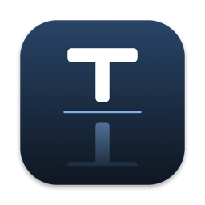

<div align="center">



# Teleprompter Mirror

[](https://github.com/trsdn/teleprompter-mirror-macos/actions/workflows/ci.yml)
[](LICENSE)
[](#voraussetzungen)
[](Package.swift)

</div>

Teleprompter Mirror ist eine eigenständige native macOS-App für einen
Teleprompter- oder Spiegelglas-Aufbau. Sie erfasst eine wählbare Quelle mit
ScreenCaptureKit, spiegelt bzw. dreht das Bild und zeigt das Ergebnis
vollflächig auf einem **physischen Zielmonitor**. Das Seitenverhältnis bleibt
erhalten; freie Flächen sind schwarz.

Als Quelle stehen drei Arten zur Verfügung:

| Quelle | Beschreibung | Wann sinnvoll |
| --- | --- | --- |
| **Virtueller Monitor** | Erzeugt einen unsichtbaren Monitor „Teleprompter Source“. | Wenn die Sprecheransicht auf keinem sichtbaren Monitor liegen soll. |
| **Monitor** | Spiegelt einen sichtbaren physischen Monitor. Quelle und Ziel dürfen nicht identisch sein. | Wenn ein vorhandener Monitor bedienbar bleiben soll. |
| **Fenster** | Spiegelt genau ein Fenster, z. B. die PowerPoint-Sprecheransicht. | Der einfachste Weg: alles bleibt sichtbar und normal bedienbar. |

Der physische Zielmonitor – standardmäßig ein Monitor namens **AAA**, sofern
vorhanden – zeigt den gespiegelten/gedrehten Stream. Weil Quelle und Ziel
getrennt sind, verdeckt die Vollbildausgabe die Quelle nicht und es entsteht
keine optische Endlosschleife.

Diese App vereint den früheren *Display Transformer* (Monitorquelle) und
*Teleprompter Mirror* (virtuelle Quelle) in einem Programm und ergänzt den
Fenstermodus.

Es gibt keine Drittanbieterpakete oder dauerhaft installierten Daemons. Nur im
Modus **Virtueller Monitor** läuft während der App-Laufzeit eine zweite Instanz
derselben signierten Binary headless als lokaler Display-Host.

## Der virtuelle Quellmonitor

Eine Aufnahme desselben physischen Monitors, auf dem auch die Vollbildausgabe
liegt, ist nicht sinnvoll: Die Ausgabe überdeckt die Quelle. Deshalb kann die
App über die **private CoreGraphics-API** (`CGVirtualDisplay`,
`CGVirtualDisplayDescriptor`, `CGVirtualDisplaySettings`,
`CGVirtualDisplayMode`) einen synthetischen Monitor „Teleprompter Source“ mit
`1920×1080@60`.

- Die privaten Klassen werden ausschließlich über `NSClassFromString`
  instanziiert (siehe `Sources/VirtualDisplayBridge`, ein separater
  Objective-C-Ziel­baustein mit ARC). Es werden keine privaten Symbole
  gelinkt.
- Der Hauptprozess startet dieselbe signierte Binary mit einem internen
  Headless-Argument. Nur dieser Display-Host hält das `CGVirtualDisplay`-
  Objekt; der Hauptprozess verwendet ausschließlich ScreenCaptureKit und die
  Ausgabe. Diese Prozessgrenze ist auf macOS 26 erforderlich, weil ein normal
  über Finder/LaunchServices gestarteter Prozess für einen selbst erzeugten
  virtuellen Monitor keine zuverlässigen Capture-Callbacks erhält.
- Der Display-Host beendet sich zusammen mit dem Hauptprozess; der virtuelle
  Monitor verschwindet dadurch spätestens eine Sekunde nach dem App-Ende.
- Der virtuelle Monitor erhält eine stabile synthetische Kennung
  (Hersteller/Produkt/Seriennummer) und sRGB-Primärfarben, damit die
  Konfiguration ihn nicht mit echter Hardware verwechselt.

Der Display-Host meldet die tatsächliche `CGDirectDisplayID` einmalig über
eine private Pipe an den Hauptprozess. Als Aufnahmequelle dient ausschließlich
der `SCDisplay` mit exakt dieser ID. ScreenCaptureKit wird dafür kurz und
begrenzt erneut abgefragt; es gibt keinen Fallback über Namen, Position oder
den zuletzt erschienenen Monitor. Nach der ersten Erkennung wartet die App
einmalig fünf Sekunden, weil macOS 26 einen neuen virtuellen Monitor bereits
auflisten kann, bevor dessen Capture-Framebuffer bereit ist. Der Filter
verwendet `excludingWindows: []`, da App- und Ausgabefenster auf physischen
Monitoren liegen und niemals auf der virtuellen Quelle erscheinen.

Das Vollbild-Ausgabefenster ist randlos, klickdurchlässig, wird nie zum Haupt-
oder Tastaturfenster und aktiviert die App nicht. Vor dem Start wird das
Steuerfenster nach Möglichkeit auf einen anderen physischen Monitor
verschoben – niemals auf den unsichtbaren virtuellen Monitor.

## Teleprompter-Aufbau

1. Den physischen Zielmonitor so platzieren, dass er in das Spiegelglas
   strahlt.
2. Das Glas typischerweise ungefähr im 45°-Winkel vor der Kamera montieren.
3. Standardmäßig ist **Horizontal spiegeln** bei **0°** aktiv. Je nach
   physischem Aufbau Drehung und vertikale Spiegelung anpassen.
4. Eine Quelle wählen: das Fenster der Sprecheransicht (empfohlen), einen
   weiteren physischen Monitor oder den virtuellen Monitor „Teleprompter
   Source“. Die Schriftgröße für den tatsächlichen Kameraabstand wählen.

## Voraussetzungen

- macOS 13 Ventura oder neuer
- Xcode oder Command Line Tools mit Swift 6
- Bildschirmaufnahme-Berechtigung für das gebaute App-Bundle

## Bauen und testen

```bash
git clone https://github.com/trsdn/teleprompter-mirror-macos.git
cd teleprompter-mirror-macos
swift test
./build-app.sh
```

Das Skript erstellt `dist/Teleprompter Mirror.app`. Es bevorzugt automatisch
eine vorhandene Identität vom Typ **Developer ID Application**, verwendet
ersatzweise **Apple Development** und fällt nur ohne stabile Identität mit
Warnung auf eine Ad-hoc-Signatur zurück. Es gibt keine fest eingetragene Team-
oder Zertifikatskennung. Eine Identität kann ausdrücklich gesetzt werden:

```bash
CODE_SIGN_IDENTITY="Developer ID Application: Name (TEAMID)" ./build-app.sh
```

Das Skript signiert mit Hardened Runtime; Developer-ID-Builds erhalten einen
Apple-Zeitstempel.

### App-Icon

Das Icon wird aus Code erzeugt und liegt fertig als `Resources/AppIcon.icns`
im Repository; für einen normalen Build ist kein zusätzlicher Schritt nötig.
Nach Änderungen an `Scripts/make-icon.swift` wird es neu generiert:

```bash
swift Scripts/make-icon.swift
```

### Optionaler Laufzeit-Selbsttest

Nur wenn **Teleprompter Mirror selbst** bereits Bildschirmaufnahmezugriff hat,
kann der signierte Build ohne neuen Berechtigungsdialog getestet werden:

```bash
open "dist/Teleprompter Mirror.app" --args --self-test
```

Der Test erzwingt die virtuelle Quelle, wählt den Standard-Zielmonitor,
startet die Ausgabe und meldet `SELF_TEST_PASS`, sobald ein vollständiger Frame
des virtuellen Quellmonitors angenommen wurde und die Ausgabeschicht den
Rendering-Status meldet – andernfalls `SELF_TEST_FAIL`. Ohne vorhandene
Berechtigung meldet er `SELF_TEST_SKIP`; er fordert sie nicht an und verändert
keine TCC-Einstellung. Der Test ersetzt keine Sichtprüfung: Er trifft weder
eine Aussage über tatsächlich sichtbare Pixel noch darüber, ob die Spiegelung
im physischen Aufbau korrekt orientiert ist.

## Bedienung

1. Unter **Quelle** die Art wählen: **Virtueller Monitor**, **Monitor** oder
   **Fenster**. Bei Monitor bzw. Fenster zusätzlich den konkreten Eintrag
   auswählen; die Fensterliste lässt sich mit dem Pfeilsymbol aktualisieren.
   Im virtuellen Modus führt **Anordnung in den Bildschirmeinstellungen …**
   direkt zur Systemeinstellung, in der festgelegt wird, an welcher Kante der
   unsichtbare Monitor liegt und wohin die Maus ihn verlässt.
2. Den physischen **Zielmonitor** für die Ausgabe auswählen (Vorgabe: **AAA**,
   sonst der kleinste externe Monitor). Der Zielmonitor kann nie zugleich
   Quelle sein.
3. Unter **Ausrichtung** Drehung `0°`, `90°`, `180°` oder `270°` sowie
   horizontale und vertikale Spiegelung einstellen. Die kleine Vorschau zeigt
   das Ergebnis sofort; **Standard** setzt auf 0° mit horizontaler Spiegelung
   zurück.
4. Bildschirmaufnahme erlauben.
5. **Ausgabe starten** wählen.

Es gibt keine Preset-Slots mehr: Jede Änderung wird sofort automatisch
gespeichert und beim nächsten Start wiederhergestellt. Alle freien Flächen
bleiben durch proportionale Einpassung schwarz. Transformationen können während
der Ausgabe geändert werden.

### Stoppen und Steuerung

- **Stoppen** im Steuerfenster
- `⌘.` solange das App-Menü bzw. Steuerfenster aktiv ist
- **Ausgabe stoppen** im Statusmenü der macOS-Menüleiste
- **Teleprompter Mirror beenden** im Statusmenü oder App-Menü

`Escape` kann im aktiven Steuer-/Menükontext den dortigen Abbruch auslösen.
Das passive Ausgabefenster wird absichtlich nie zum Tastaturfenster und kann
`Escape` deshalb nicht selbst empfangen. Das Statusmenü bleibt der
zuverlässige Stoppweg, auch wenn das Steuerfenster verdeckt oder geschlossen
ist. Es werden keine globalen Tastatur-Event-Taps installiert.

## Rendering und Ressourcenverbrauch

Die Aufnahme ist auf 30 Hz und `queueDepth = 4` begrenzt. Nur
ScreenCaptureKit-Screen-Samples mit Frame-Status `complete`, gültigem
Sample-Buffer und `CVPixelBuffer` werden weitergereicht. Die Capture-Auflösung
(BGRA) wird proportional auf höchstens die längste Kante des Zielmonitors
begrenzt, damit große Quellen wie ein 5120×1440-Monitor nicht unnötig in voller
Auflösung übertragen werden. Audio ist aus; im Fenstermodus wird der Mauszeiger
nicht mitaufgenommen. Gemessener Verbrauch im laufenden Betrieb: rund 1–3 % CPU
und unter 50 MB Arbeitsspeicher.

Der bevorzugte Pfad
`ScreenCaptureKit → AVSampleBufferDisplayLayer` reicht IOSurface-gestützte
BGRA-Puffer readiness- und backpressure-gesteuert direkt weiter; Frames werden
nicht angestaut. Eine Sitzung kann höchstens einmal auf
`Core Image → CALayer` zurückfallen. Dieser sichere Fallback hält nur den
neuesten Frame und erzeugt Kontext und 30-Hz-Timer erst bei Bedarf. Beim
Stoppen werden Frame, Timer, Layer und Kontext freigegeben. Die App verwendet
kein `MTKView`. Eine zunächst leere virtuelle Quelle bleibt aktiv, damit
PowerPoint oder ein anderes Fenster auch später auf den virtuellen Desktop
verschoben werden kann. Echte Stream- und Renderfehler werden weiterhin
explizit gemeldet.

Der vollständige Finder-/LaunchServices-Pfad wurde auf macOS 26.6.1 mit einem
asymmetrischen L/R-Testbild auf dem physischen Zielmonitor AAA visuell geprüft:
Das rote `R` erschien links und das gelbe `L` rechts, die horizontale
Spiegelung war damit korrekt.

## Gespeicherte Konfiguration und Monitoridentität

Die App speichert genau eine Konfiguration per `Codable` in `UserDefaults`:
Quellenart, gewählte Quelle, **Zielmonitoridentität** und Transformation. Ältere
Einstellungen mit drei Preset-Slots werden beim ersten Start automatisch auf die
zuletzt aktive Konfiguration migriert; noch ältere Stände mit einer
Monitoridentität unter `display` werden weiterhin als Zielmonitor übernommen.

Ein Fenster wird über Bundle-ID, App-Name und Fenstertitel wiedererkannt,
niemals über die flüchtige `CGWindowID` allein. Mehrdeutige Treffer werden nicht
automatisch verwendet.

Eine Monitoridentität kombiniert, soweit verfügbar:

- Hersteller-, Produkt- und Seriennummer
- stabile Display-UUID
- als eindeutigen Fallback normalisierten Namen und rotationsunabhängige native
  Pixelabmessungen

Eine flüchtige `CGDirectDisplayID` wird nie allein oder dauerhaft gespeichert.
Mehrdeutige Treffer werden nicht automatisch verwendet.

## Berechtigung, Anmeldestart und Wiederverbinden

Unter **Systemeinstellungen → Datenschutz & Sicherheit → Bildschirmaufnahme**
muss das konkrete signierte App-Bundle erlaubt sein. Eine stabile Signatur,
Bundle-ID und ein stabiler App-Pfad helfen macOS, die Berechtigung nach Builds
wiederzuerkennen. Das Erstellen des virtuellen Monitors selbst benötigt keine
Bildschirmaufnahme-Berechtigung; nur seine Erfassung.

**Bei Anmeldung starten** verwendet `SMAppService.mainApp`. Für zuverlässigen
Anmeldestart sollte die signierte App zuerst nach `/Applications` verschoben
und von dort registriert werden. **Ausgabe beim App-Start automatisch starten**
ist eine getrennte Option.

Fehlt beim Start der gespeicherte Zielmonitor oder wird er getrennt, wartet die
App ohne Polling auf `didChangeScreenParametersNotification`. Bei eindeutiger
Rückkehr startet eine gewünschte automatische Ausgabe wieder. Ein manueller
Stopp unterdrückt jeden automatischen Neustart für die laufende App-Sitzung;
erst ein ausdrückliches **Ausgabe starten** hebt die Unterdrückung auf.
Aufnahme- oder Renderfehler werden blockiert, statt Neustartschleifen zu
erzeugen.

## Einschränkungen

- Die App nutzt eine **private, nicht dokumentierte** CoreGraphics-API für den
  virtuellen Monitor. Diese kann sich zwischen macOS-Versionen ändern und ist
  **nicht App-Store-tauglich**. Ist die API nicht verfügbar, meldet die App
  dies und startet keine Ausgabe; Monitor- und Fenstermodus bleiben nutzbar.
- Der virtuelle Monitor ist blind bedienbar: Er hat eine eigene Menüleiste und
  ist nur als gespiegeltes Bild sichtbar, weshalb die Maus dort „falsch herum“
  wirkt. Für interaktive Arbeit sind Monitor- oder Fenstermodus vorzuziehen.
- Im Fenstermodus endet die Ausgabe, wenn das Quellfenster geschlossen wird.
  Die App aktualisiert dann automatisch die Fensterliste.
- Die Spiegelung erfolgt in der Ausgabe-Ebene (Core Animation / Core Image).
  Es findet **kein** physischer Scanout-Flip des Monitors statt; die App kann
  daher nicht garantieren, dass die Orientierung im konkreten Spiegelglas-
  Aufbau korrekt ist – Drehung und Spiegelung sind entsprechend einzustellen.
- Ist nur ein physischer Monitor verbunden, dient dieser als Ziel und die
  Ausgabe überdeckt dort den Schreibtisch. In diesem Fall bleibt die Menüleiste
  bewusst über dem klickdurchlässigen Ausgabefenster erreichbar, damit das
  Statusmenü zum Stoppen und erneuten Anzeigen der Steuerung verfügbar bleibt.
  Sobald mindestens ein weiterer Monitor verbunden ist, deckt die Ausgabe den
  Zielmonitor vollständig ab – inklusive dessen Menüleiste und Dock –, weil dort
  sonst die Menüs der gerade aktiven App statt des gespiegelten Bildes zu sehen
  wären.
- Der virtuelle Monitor ist headless und verwendet einen 1920×1080-HiDPI-
  Framebuffer; Fenster müssen ggf. „blind“ dorthin verschoben werden.
- DRM-/HDCP-geschützte Inhalte können von macOS **schwarz** geliefert werden.
- Audio wird nicht übertragen; der Mauszeiger wird erfasst.
- Seriennummernlose, identische Zielmonitore ohne eindeutige UUID, Namen oder
  native Abmessungen erfordern eine erneute manuelle Auswahl.
- Das Build-Skript erzeugt standardmäßig die aktuelle Mac-Architektur, kein
  Universal Binary.

## Mitwirken

Beiträge sind willkommen. Der Entwicklungsablauf, die Sprach- und
Commit-Konventionen sowie der bewusst eng gehaltene Projektumfang sind in
[CONTRIBUTING.md](CONTRIBUTING.md) beschrieben.

Sicherheitsrelevante Funde bitte **nicht** als Issue melden, sondern wie in
[SECURITY.md](SECURITY.md) beschrieben über eine private Meldung.

## Lizenz

[MIT](LICENSE) – Copyright © 2026 Torsten Mahr.
